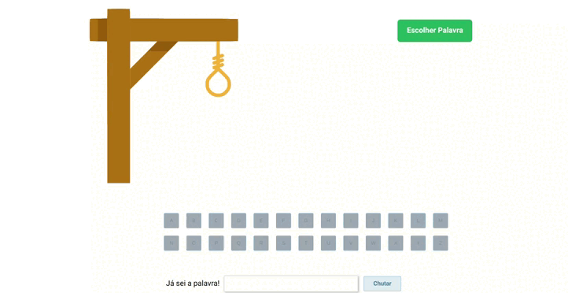

HANGMAN GAME

In the Hangman game, players guess a word letter by letter. They must guess the word correctly before making 6 mistakes to win. If they make 6 mistakes, they lose the game.





You can access the deployment through the link below:
    https://play-hangman-game.vercel.app/

Tools

<div>
    
    
    
    
    
    
    
</div>

<br>
How to run

1. Clone this repository:
```bash
    https://github.com/montenegroleticia/HangmanGame.git
```
2. Clone the back-end repository at and follow instructions to run:
```bash
    https://github.com/montenegroleticia/MyWallet-api
```
3. Install dependencies:
```bash
npm i
```
4. Run the front-end with:
```bash
npm start
```
5. Finally access on your favorite browser:
```bash
http://localhost:3000
```
